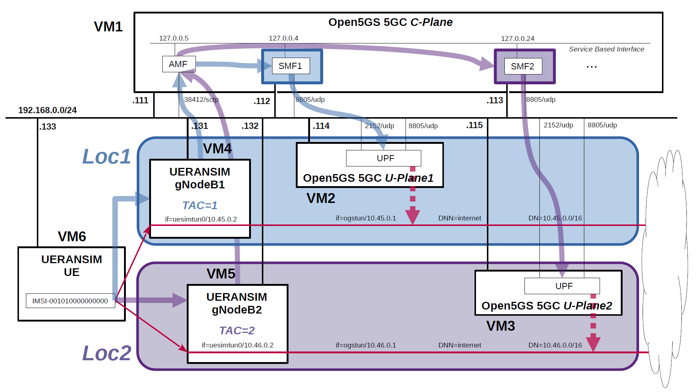

# Open5GS 5GC & UERANSIM UE / RAN Sample Configuration - Select nearby UPF according to the connected gNodeB
This describes a very simple configuration that uses Open5GS and UERANSIM to select the nearby UPF according to the connected gNodeB.

---

<h2 id="toc">Table of Contents</h2>

- [Overview of Open5GS 5GC Simulation Mobile Network](#overview)
- [Changes in configuration files of Open5GS 5GC and UERANSIM UE / RAN](#changes)
  - [Changes in configuration files of Open5GS 5GC C-Plane](#changes_cp)
  - [Changes in configuration files of Open5GS 5GC U-Plane1](#changes_up1)
  - [Changes in configuration files of Open5GS 5GC U-Plane2](#changes_up2)
  - [Changes in configuration files of UERANSIM UE / RAN](#changes_ueransim)
    - [Changes in configuration files of RAN (gNodeB1)](#changes_ran1)
    - [Changes in configuration files of RAN (gNodeB2)](#changes_ran2)
    - [Changes in configuration files of UE for Loc1 (IMSI-001010000000000)](#changes_ue_loc1)
    - [Changes in configuration files of UE for Loc2 (IMSI-001010000000000)](#changes_ue_loc2)
- [Network settings of Open5GS 5GC and UERANSIM UE / RAN](#network_settings)
  - [Network settings of Open5GS 5GC C-Plane](#network_settings_cp)
  - [Network settings of Open5GS 5GC U-Plane1](#network_settings_up1)
  - [Network settings of Open5GS 5GC U-Plane2](#network_settings_up2)
- [Build Open5GS and UERANSIM](#build)
- [Run Open5GS 5GC and UERANSIM UE / RAN](#run)
  - [Run Open5GS 5GC C-Plane](#run_cp)
  - [Run Open5GS 5GC U-Plane1 & U-Plane2](#run_up)
  - [Run UERANSIM (gNodeBs)](#run_ran)
    - [Start gNodeB1 with TAC=1 in Loc1](#run_ran1)
    - [Start gNodeB2 with TAC=2 in Loc2](#run_ran2)
  - [Run UERANSIM (UE in Loc1)](#run_ue1)
    - [Start UE connected to gNodeB1 in Loc1](#con_ue1)
    - [Ping google.com going through DN=10.45.0.0/16 on Loc1](#ping_ue1)
  - [Run UERANSIM (UE in Loc2)](#run_ue2)
    - [Start UE connected to gNodeB1 in Loc2](#con_ue2)
    - [Ping google.com going through DN=10.46.0.0/16 on Loc2](#ping_ue2)
- [Changelog (summary)](#changelog)

---
<h2 id="overview">Overview of Open5GS 5GC Simulation Mobile Network</h2>

The following minimum configuration was set as a condition.
- The pair of gNodeB and UPF exists in the same location.
- The UE connected to gNodeB connects to DN managed by UPF in the same location.

**In this example, TAC is matched to connect gNodeB and AMF, and AMF searches for SMF using TAC as part of the TAI parameter.**

The built simulation environment is as follows.

</img>

The 5GC / UE / RAN used are as follows.
- 5GC - Open5GS v2.3.2 - https://github.com/open5gs/open5gs
- UE / RAN - UERANSIM v3.2.3 - https://github.com/aligungr/UERANSIM

Each VMs are as follows.  
| VM # | SW & Role | IP address | OS | Memory (Min) | HDD (Min) |
| --- | --- | --- | --- | --- | --- |
| VM1 | Open5GS 5GC C-Plane | 192.168.0.111/24 <br> 192.168.0.112/24 <br> 192.168.0.113/24 | Ubuntu 20.04 | 1GB | 20GB |
| VM2 | Open5GS 5GC U-Plane1  | 192.168.0.114/24 | Ubuntu 20.04 | 1GB | 20GB |
| VM3 | Open5GS 5GC U-Plane2  | 192.168.0.115/24 | Ubuntu 20.04 | 1GB | 20GB |
| VM4 | UERANSIM RAN (gNodeB1) | 192.168.0.131/24 | Ubuntu 20.04 | 1GB | 10GB |
| VM5 | UERANSIM RAN (gNodeB2) | 192.168.0.132/24 | Ubuntu 20.04 | 1GB | 10GB |
| VM6 | UERANSIM UE | 192.168.0.133/24 | Ubuntu 20.04 | 1GB | 10GB |

AMF & SMF addresses are as follows.  
| NF | IP address | IP address on SBI | Supported TACs |
| --- | --- | --- | --- |
| AMF | 192.168.0.111 | 127.0.0.5 | 1, 2 |
| SMF1 | 192.168.0.112 | 127.0.0.4 | 1 |
| SMF2 | 192.168.0.113 | 127.0.0.24 | 2 |

gNodeB Information (other information is default) is as follows.  
| gNodeB # | Location # | TAC # | IP address |
| --- | --- | --- | --- |
| gNodeB1 | Loc1 | 1 | 192.168.0.131 |
| gNodeB2 | Loc2 | 2 | 192.168.0.132 |

Subscriber Information (other information is default) is as follows.  
**Note. Please select OP or OPc according to the setting of UERANSIM UE configuration files.**
| UE | IMSI | DNN | OP/OPc | gNodeB # |
| --- | --- | --- | --- | --- |
| UE | 001010000000000 | internet | OPc | gNodeB1 in Loc1 <br> gNodeB2 in Loc2|

I registered these information with the Open5GS WebUI.
In addition, [3GPP TS 35.208](https://www.3gpp.org/DynaReport/35208.htm) "4.3 Test Sets" is published by 3GPP as test data for the 3GPP authentication and key generation functions (MILENAGE).

Each DNs are as follows.
| DN | Location # |  TUNnel interface of DN | DNN | TUNnel interface of UE | U-Plane # |
| --- | --- | --- | --- | --- | --- |
| 10.45.0.0/16 | Loc1 | ogstun | internet | uesimtun0 | U-Plane1 |
| 10.46.0.0/16 | Loc2 | ogstun | internet | uesimtun0 | U-Plane2 |

<h2 id="changes">Changes in configuration files of Open5GS 5GC and UERANSIM UE / RAN</h2>

Please refer to the following for building Open5GS and UERANSIM respectively.
- Open5GS v2.3.2 - https://open5gs.org/open5gs/docs/guide/02-building-open5gs-from-sources/
- UERANSIM v3.2.3 - https://github.com/aligungr/UERANSIM/wiki/Installation

<h3 id="changes_cp">Changes in configuration files of Open5GS 5GC C-Plane</h3>

- `open5gs/install/etc/open5gs/amf.yaml`
```diff
--- amf.yaml.orig       2021-08-09 14:06:48.000000000 +0000
+++ amf.yaml    2021-08-09 15:24:58.000000000 +0000
@@ -180,23 +180,23 @@
       - addr: 127.0.0.5
         port: 7777
     ngap:
-      - addr: 127.0.0.5
+      - addr: 192.168.0.111
     guami:
       - plmn_id:
-          mcc: 901
-          mnc: 70
+          mcc: 001
+          mnc: 01
         amf_id:
           region: 2
           set: 1
     tai:
       - plmn_id:
-          mcc: 901
-          mnc: 70
-        tac: 1
+          mcc: 001
+          mnc: 01
+        tac: [1, 2]
     plmn_support:
       - plmn_id:
-          mcc: 901
-          mnc: 70
+          mcc: 001
+          mnc: 01
         s_nssai:
           - sst: 1
     security:
```
- `open5gs/install/etc/open5gs/smf1.yaml`
```diff
--- smf.yaml.orig       2021-08-16 04:11:23.480627159 +0000
+++ smf1.yaml   2021-08-16 04:36:38.574964510 +0000
@@ -332,24 +332,31 @@
       - addr: 127.0.0.4
         port: 7777
     pfcp:
-      - addr: 127.0.0.4
-      - addr: ::1
+      - addr: 192.168.0.112
     gtpc:
       - addr: 127.0.0.4
-      - addr: ::1
     gtpu:
       - addr: 127.0.0.4
-      - addr: ::1
     subnet:
       - addr: 10.45.0.1/16
-      - addr: 2001:230:cafe::1/48
+        dnn: internet
     dns:
       - 8.8.8.8
       - 8.8.4.4
       - 2001:4860:4860::8888
       - 2001:4860:4860::8844
     mtu: 1400
-    freeDiameter: /root/open5gs/install/etc/freeDiameter/smf.conf
+    freeDiameter: /root/open5gs/install/etc/freeDiameter/smf1.conf
+    info:
+      - s_nssai:
+          - sst: 1
+            dnn:
+              - internet
+        tai:
+          - plmn_id:
+              mcc: 001
+              mnc: 01
+            tac: 1
 
 #
 # nrf:
@@ -438,7 +445,8 @@
 #
 upf:
     pfcp:
-      - addr: 127.0.0.7
+      - addr: 192.168.0.114
+        dnn: internet
 
 #
 # parameter:
```
- `open5gs/install/etc/open5gs/smf2.yaml`
```diff
--- smf.yaml.orig       2021-08-16 04:11:23.480627159 +0000
+++ smf2.yaml   2021-08-16 04:40:02.146683202 +0000
@@ -329,27 +329,34 @@
 
 smf:
     sbi:
-      - addr: 127.0.0.4
+      - addr: 127.0.0.24
         port: 7777
     pfcp:
-      - addr: 127.0.0.4
-      - addr: ::1
+      - addr: 192.168.0.113
     gtpc:
-      - addr: 127.0.0.4
-      - addr: ::1
+      - addr: 127.0.0.24
     gtpu:
-      - addr: 127.0.0.4
-      - addr: ::1
+      - addr: 127.0.0.24
     subnet:
-      - addr: 10.45.0.1/16
-      - addr: 2001:230:cafe::1/48
+      - addr: 10.46.0.1/16
+        dnn: internet
     dns:
       - 8.8.8.8
       - 8.8.4.4
       - 2001:4860:4860::8888
       - 2001:4860:4860::8844
     mtu: 1400
-    freeDiameter: /root/open5gs/install/etc/freeDiameter/smf.conf
+    freeDiameter: /root/open5gs/install/etc/freeDiameter/smf2.conf
+    info:
+      - s_nssai:
+          - sst: 1
+            dnn:
+              - internet
+        tai:
+          - plmn_id:
+              mcc: 001
+              mnc: 01
+            tac: 2
 
 #
 # nrf:
@@ -438,7 +445,8 @@
 #
 upf:
     pfcp:
-      - addr: 127.0.0.7
+      - addr: 192.168.0.115
+        dnn: internet
 
 #
 # parameter:
```
- `open5gs/install/etc/freeDiameter/smf1.conf`  
`smf1.conf` is equal to the original `smf.conf`.
- `open5gs/install/etc/freeDiameter/smf2.conf`
```diff
--- smf.conf.orig       2021-08-09 14:06:48.000000000 +0000
+++ smf2.conf   2021-08-09 16:01:40.000000000 +0000
@@ -79,7 +79,7 @@
 #ListenOn = "202.249.37.5";
 #ListenOn = "2001:200:903:2::202:1";
 #ListenOn = "fe80::21c:5ff:fe98:7d62%eth0";
-ListenOn = "127.0.0.4";
+ListenOn = "127.0.0.24";
 
 
 ##############################################################
```

<h3 id="changes_up1">Changes in configuration files of Open5GS 5GC U-Plane1</h3>

- `open5gs/install/etc/open5gs/upf.yaml`
```diff
--- upf.yaml.orig       2021-08-16 04:19:12.609215680 +0000
+++ upf.yaml    2021-08-16 04:45:21.939153916 +0000
@@ -150,12 +150,13 @@
 #
 upf:
     pfcp:
-      - addr: 127.0.0.7
+      - addr: 192.168.0.114
     gtpu:
-      - addr: 127.0.0.7
+      - addr: 192.168.0.114
     subnet:
       - addr: 10.45.0.1/16
-      - addr: 2001:230:cafe::1/48
+        dnn: internet
+        dev: ogstun
 
 #
 # smf:
```

<h3 id="changes_up2">Changes in configuration files of Open5GS 5GC U-Plane2</h3>

- `open5gs/install/etc/open5gs/upf.yaml`
```diff
--- upf.yaml.orig       2021-08-16 04:27:23.259794801 +0000
+++ upf.yaml    2021-08-16 04:48:22.276655390 +0000
@@ -150,12 +150,13 @@
 #
 upf:
     pfcp:
-      - addr: 127.0.0.7
+      - addr: 192.168.0.115
     gtpu:
-      - addr: 127.0.0.7
+      - addr: 192.168.0.115
     subnet:
-      - addr: 10.45.0.1/16
-      - addr: 2001:230:cafe::1/48
+      - addr: 10.46.0.1/16
+        dnn: internet
+        dev: ogstun
 
 #
 # smf:
```

<h3 id="changes_ueransim">Changes in configuration files of UERANSIM UE / RAN</h3>

<h4 id="changes_ran1">Changes in configuration files of RAN (gNodeB1)</h4>

- `UERANSIM/config/open5gs-gnb.yaml`
```diff
--- open5gs-gnb.yaml.orig       2021-04-19 21:30:50.000000000 +0000
+++ open5gs-gnb.yaml    2021-08-09 16:09:56.000000000 +0000
@@ -1,17 +1,17 @@
-mcc: '901'          # Mobile Country Code value
-mnc: '70'           # Mobile Network Code value (2 or 3 digits)
+mcc: '001'          # Mobile Country Code value
+mnc: '01'           # Mobile Network Code value (2 or 3 digits)
 
 nci: '0x000000010'  # NR Cell Identity (36-bit)
 idLength: 32        # NR gNB ID length in bits [22...32]
 tac: 1              # Tracking Area Code
 
-linkIp: 127.0.0.1   # gNB's local IP address for Radio Link Simulation (Usually same with local IP)
-ngapIp: 127.0.0.1   # gNB's local IP address for N2 Interface (Usually same with local IP)
-gtpIp: 127.0.0.1    # gNB's local IP address for N3 Interface (Usually same with local IP)
+linkIp: 192.168.0.131   # gNB's local IP address for Radio Link Simulation (Usually same with local IP)
+ngapIp: 192.168.0.131   # gNB's local IP address for N2 Interface (Usually same with local IP)
+gtpIp: 192.168.0.131    # gNB's local IP address for N3 Interface (Usually same with local IP)
 
 # List of AMF address information
 amfConfigs:
-  - address: 127.0.0.5
+  - address: 192.168.0.111
     port: 38412
 
 # List of supported S-NSSAIs by this gNB
```

<h4 id="changes_ran2">Changes in configuration files of RAN (gNodeB2)</h4>

- `UERANSIM/config/open5gs-gnb.yaml`
```diff
--- open5gs-gnb.yaml.orig       2021-04-19 21:30:50.000000000 +0000
+++ open5gs-gnb.yaml    2021-08-09 16:10:18.000000000 +0000
@@ -1,17 +1,17 @@
-mcc: '901'          # Mobile Country Code value
-mnc: '70'           # Mobile Network Code value (2 or 3 digits)
+mcc: '001'          # Mobile Country Code value
+mnc: '01'           # Mobile Network Code value (2 or 3 digits)
 
 nci: '0x000000010'  # NR Cell Identity (36-bit)
 idLength: 32        # NR gNB ID length in bits [22...32]
-tac: 1              # Tracking Area Code
+tac: 2              # Tracking Area Code
 
-linkIp: 127.0.0.1   # gNB's local IP address for Radio Link Simulation (Usually same with local IP)
-ngapIp: 127.0.0.1   # gNB's local IP address for N2 Interface (Usually same with local IP)
-gtpIp: 127.0.0.1    # gNB's local IP address for N3 Interface (Usually same with local IP)
+linkIp: 192.168.0.132   # gNB's local IP address for Radio Link Simulation (Usually same with local IP)
+ngapIp: 192.168.0.132   # gNB's local IP address for N2 Interface (Usually same with local IP)
+gtpIp: 192.168.0.132    # gNB's local IP address for N3 Interface (Usually same with local IP)
 
 # List of AMF address information
 amfConfigs:
-  - address: 127.0.0.5
+  - address: 192.168.0.111
     port: 38412
 
 # List of supported S-NSSAIs by this gNB
```

<h4 id="changes_ue_loc1">Changes in configuration files of UE for Loc1 (IMSI-001010000000000)</h4>

- `UERANSIM/config/open5gs-ue-loc1.yaml`
```diff
--- open5gs-ue.yaml.orig        2021-08-15 14:16:46.000000000 +0000
+++ open5gs-ue-loc1.yaml        2021-08-16 05:27:24.848045392 +0000
@@ -1,9 +1,9 @@
 # IMSI number of the UE. IMSI = [MCC|MNC|MSISDN] (In total 15 digits)
-supi: 'imsi-901700000000001'
+supi: 'imsi-001010000000000'
 # Mobile Country Code value of HPLMN
-mcc: '901'
+mcc: '001'
 # Mobile Network Code value of HPLMN (2 or 3 digits)
-mnc: '70'
+mnc: '01'
 
 # Permanent subscription key
 key: '465B5CE8B199B49FAA5F0A2EE238A6BC'
@@ -20,7 +20,7 @@
 
 # List of gNB IP addresses for Radio Link Simulation
 gnbSearchList:
-  - 127.0.0.1
+  - 192.168.0.131
 
 # UAC Access Identities Configuration
 uacAic:
```

<h4 id="changes_ue_loc2">Changes in configuration files of UE for Loc2 (IMSI-001010000000000)</h4>

- `UERANSIM/config/open5gs-ue-loc2.yaml`
```diff
--- open5gs-ue.yaml.orig        2021-08-15 14:16:46.000000000 +0000
+++ open5gs-ue-loc2.yaml        2021-08-16 05:27:37.432117009 +0000
@@ -1,9 +1,9 @@
 # IMSI number of the UE. IMSI = [MCC|MNC|MSISDN] (In total 15 digits)
-supi: 'imsi-901700000000001'
+supi: 'imsi-001010000000000'
 # Mobile Country Code value of HPLMN
-mcc: '901'
+mcc: '001'
 # Mobile Network Code value of HPLMN (2 or 3 digits)
-mnc: '70'
+mnc: '01'
 
 # Permanent subscription key
 key: '465B5CE8B199B49FAA5F0A2EE238A6BC'
@@ -20,7 +20,7 @@
 
 # List of gNB IP addresses for Radio Link Simulation
 gnbSearchList:
-  - 127.0.0.1
+  - 192.168.0.132
 
 # UAC Access Identities Configuration
 uacAic:
```

<h2 id="network_settings">Network settings of Open5GS 5GC and UERANSIM UE / RAN</h2>

<h3 id="network_settings_cp">Network settings of Open5GS 5GC C-Plane</h3>

Add IP addresses for SMF1 and SMF2.
```
ip addr add 192.168.0.112/24 dev enp0s8
ip addr add 192.168.0.113/24 dev enp0s8
```

<h3 id="network_settings_up1">Network settings of Open5GS 5GC U-Plane1</h3>

First, uncomment the next line in the `/etc/sysctl.conf` file and reflect it in the OS.
```
net.ipv4.ip_forward=1
```
```
# sysctl -p
```
Next, configure the TUNnel interface and NAPT.
```
ip tuntap add name ogstun mode tun
ip addr add 10.45.0.1/16 dev ogstun
ip link set ogstun up

iptables -t nat -A POSTROUTING -s 10.45.0.0/16 ! -o ogstun -j MASQUERADE
```

<h3 id="network_settings_up2">Network settings of Open5GS 5GC U-Plane2</h3>

First, uncomment the next line in the `/etc/sysctl.conf` file and reflect it in the OS.
```
net.ipv4.ip_forward=1
```
```
# sysctl -p
```
Next, configure the TUNnel interface and NAPT.
```
ip tuntap add name ogstun mode tun
ip addr add 10.46.0.1/16 dev ogstun
ip link set ogstun up

iptables -t nat -A POSTROUTING -s 10.46.0.0/16 ! -o ogstun -j MASQUERADE
```

<h2 id="build">Build Open5GS and UERANSIM</h2>

Please refer to the following for building Open5GS and UERANSIM respectively.
- Open5GS v2.3.2 - https://open5gs.org/open5gs/docs/guide/02-building-open5gs-from-sources/
- UERANSIM v3.2.3 - https://github.com/aligungr/UERANSIM/wiki/Installation

Note. Install MongoDB with package manager on Open5GS 5GC C-Plane machine.
[MongoDB Compass](https://www.mongodb.com/products/compass) is a convenient tool to look at the MongoDB database.
```
# apt update
# apt install mongodb
# systemctl start mongodb
# systemctl enable mongodb
```
It is not necessary to install MongoDB on Open5GS 5GC U-Plane machines.

<h2 id="run">Run Open5GS 5GC and UERANSIM UE / RAN</h2>

First run the 5GC, then UERANSIM (UE & RAN implementation).

<h3 id="run_cp">Run Open5GS 5GC C-Plane</h3>

First, run Open5GS 5GC C-Plane.

- Open5GS 5GC C-Plane
```
./install/bin/open5gs-nrfd &
sleep 5
./install/bin/open5gs-smfd -c install/etc/open5gs/smf1.yaml &
./install/bin/open5gs-smfd -c install/etc/open5gs/smf2.yaml &
./install/bin/open5gs-amfd &
./install/bin/open5gs-ausfd &
./install/bin/open5gs-udmd &
./install/bin/open5gs-udrd &
./install/bin/open5gs-pcfd &
./install/bin/open5gs-nssfd &
./install/bin/open5gs-bsfd &
```

<h3 id="run_up">Run Open5GS 5GC U-Plane1 & U-Plane2</h3>

Next, run Open5GS 5GC U-Plane.

- Open5GS 5GC U-Plane1
```
./install/bin/open5gs-upfd &
```
- Open5GS 5GC U-Plane2
```
./install/bin/open5gs-upfd &
```
Then run `tcpdump` on one more terminal for each U-Plane.
- Run `tcpdump` on VM2 (U-Plane1)
```
# tcpdump -i ogstun -n
tcpdump: verbose output suppressed, use -v or -vv for full protocol decode
listening on ogstun, link-type RAW (Raw IP), capture size 262144 bytes
```
- Run `tcpdump` on VM3 (U-Plane2)
```
# tcpdump -i ogstun -n
tcpdump: verbose output suppressed, use -v or -vv for full protocol decode
listening on ogstun, link-type RAW (Raw IP), capture size 262144 bytes
```

<h3 id="run_ran">Run UERANSIM (gNodeBs)</h3>

Run each gNodeB with TAC=1 and TAC=2 in two locations.  
Please refer to the following for usage of UERANSIM.

https://github.com/aligungr/UERANSIM/wiki/Usage

<h4 id="run_ran1">Start gNodeB1 with TAC=1 in Loc1</h4>

```
# ./nr-gnb -c ../config/open5gs-gnb.yaml
UERANSIM v3.2.3
[2021-08-17 03:05:44.206] [sctp] [info] Trying to establish SCTP connection... (192.168.0.111:38412)
[2021-08-17 03:05:44.256] [sctp] [info] SCTP connection established (192.168.0.111:38412)
[2021-08-17 03:05:44.256] [sctp] [debug] SCTP association setup ascId[3]
[2021-08-17 03:05:44.256] [ngap] [debug] Sending NG Setup Request
[2021-08-17 03:05:44.410] [ngap] [debug] NG Setup Response received
[2021-08-17 03:05:44.411] [ngap] [info] NG Setup procedure is successful
```
The Open5GS C-Plane log when executed is as follows.
```
08/17 03:05:44.256: [amf] INFO: gNB-N2 accepted[192.168.0.131]:36137 in ng-path module (../src/amf/ngap-sctp.c:105)
08/17 03:05:44.257: [amf] INFO: gNB-N2 accepted[192.168.0.131] in master_sm module (../src/amf/amf-sm.c:607)
08/17 03:05:44.257: [amf] INFO: [GNB] max_num_of_ostreams : 30 (../src/amf/context.c:854)
08/17 03:05:44.257: [amf] INFO: [Added] Number of gNBs is now 1 (../src/amf/context.c:869)
```

<h4 id="run_ran2">Start gNodeB2 with TAC=2 in Loc2</h4>

```
# ./nr-gnb -c ../config/open5gs-gnb.yaml
UERANSIM v3.2.3
[2021-08-17 03:09:06.701] [sctp] [info] Trying to establish SCTP connection... (192.168.0.111:38412)
[2021-08-17 03:09:06.755] [sctp] [info] SCTP connection established (192.168.0.111:38412)
[2021-08-17 03:09:06.755] [sctp] [debug] SCTP association setup ascId[3]
[2021-08-17 03:09:06.755] [ngap] [debug] Sending NG Setup Request
[2021-08-17 03:09:06.803] [ngap] [debug] NG Setup Response received
[2021-08-17 03:09:06.803] [ngap] [info] NG Setup procedure is successful
```
The Open5GS C-Plane log when executed is as follows.
```
08/17 03:09:06.740: [amf] INFO: gNB-N2 accepted[192.168.0.132]:40655 in ng-path module (../src/amf/ngap-sctp.c:105)
08/17 03:09:06.740: [amf] INFO: gNB-N2 accepted[192.168.0.132] in master_sm module (../src/amf/amf-sm.c:607)
08/17 03:09:06.740: [amf] INFO: [GNB] max_num_of_ostreams : 30 (../src/amf/context.c:854)
08/17 03:09:06.740: [amf] INFO: [Added] Number of gNBs is now 2 (../src/amf/context.c:869)
```

<h3 id="run_ue1">Run UERANSIM (UE in Loc1)</h3>

Confirm that the packet goes through the DN of U-Plane1 in the same Loc1 by connecting to gNodeB1 in Loc1.

<h4 id="con_ue1">Start UE connected to gNodeB1 in Loc1</h4>

```
# ./nr-ue -c ../config/open5gs-ue-loc1.yaml 
UERANSIM v3.2.3
[2021-08-17 03:44:28.012] [rrc] [debug] New signal detected for cell[1], total [1] cells in coverage
[2021-08-17 03:44:28.013] [nas] [info] UE switches to state [MM-DEREGISTERED/PLMN-SEARCH]
[2021-08-17 03:44:28.013] [nas] [info] Selected plmn[001/01]
[2021-08-17 03:44:30.510] [rrc] [info] Selected cell plmn[001/01] tac[1] category[SUITABLE]
[2021-08-17 03:44:30.511] [nas] [info] UE switches to state [MM-DEREGISTERED/PS]
[2021-08-17 03:44:30.511] [nas] [info] UE switches to state [MM-DEREGISTERED/NORMAL-SERVICE]
[2021-08-17 03:44:30.512] [nas] [debug] Initial registration required due to [MM-DEREG-NORMAL-SERVICE]
[2021-08-17 03:44:30.513] [nas] [debug] UAC access attempt is allowed for identity[0], category[MO_sig]
[2021-08-17 03:44:30.513] [nas] [debug] Sending Initial Registration
[2021-08-17 03:44:30.516] [rrc] [debug] Sending RRC Setup Request
[2021-08-17 03:44:30.517] [nas] [info] UE switches to state [MM-REGISTER-INITIATED]
[2021-08-17 03:44:30.517] [rrc] [info] RRC connection established
[2021-08-17 03:44:30.518] [rrc] [info] UE switches to state [RRC-CONNECTED]
[2021-08-17 03:44:30.518] [nas] [info] UE switches to state [CM-CONNECTED]
[2021-08-17 03:44:30.636] [nas] [debug] Authentication Request received
[2021-08-17 03:44:30.641] [nas] [debug] Security Mode Command received
[2021-08-17 03:44:30.642] [nas] [debug] Selected integrity[2] ciphering[0]
[2021-08-17 03:44:30.679] [nas] [debug] Registration accept received
[2021-08-17 03:44:30.679] [nas] [info] UE switches to state [MM-REGISTERED/NORMAL-SERVICE]
[2021-08-17 03:44:30.679] [nas] [debug] Sending Registration Complete
[2021-08-17 03:44:30.680] [nas] [info] Initial Registration is successful
[2021-08-17 03:44:30.680] [nas] [debug] Sending PDU Session Establishment Request
[2021-08-17 03:44:30.680] [nas] [debug] UAC access attempt is allowed for identity[0], category[MO_sig]
[2021-08-17 03:44:30.883] [nas] [debug] Configuration Update Command received
[2021-08-17 03:44:30.904] [nas] [debug] PDU Session Establishment Accept received
[2021-08-17 03:44:30.909] [nas] [info] PDU Session establishment is successful PSI[1]
[2021-08-17 03:44:30.927] [app] [info] Connection setup for PDU session[1] is successful, TUN interface[uesimtun0, 10.45.0.2] is up.
```
The Open5GS C-Plane log when executed is as follows.
```
08/17 03:44:30.484: [amf] INFO: InitialUEMessage (../src/amf/ngap-handler.c:361)
08/17 03:44:30.484: [amf] INFO: [Added] Number of gNB-UEs is now 1 (../src/amf/context.c:2005)
08/17 03:44:30.484: [amf] INFO:     RAN_UE_NGAP_ID[1] AMF_UE_NGAP_ID[1] TAC[1] CellID[0x10] (../src/amf/ngap-handler.c:497)
08/17 03:44:30.515: [amf] INFO: [suci-0-001-01-0000-0-0-0000000000] Unknown UE by SUCI (../src/amf/context.c:1385)
08/17 03:44:30.515: [amf] INFO: [Added] Number of AMF-UEs is now 1 (../src/amf/context.c:1187)
08/17 03:44:30.515: [gmm] INFO: Registration request (../src/amf/gmm-sm.c:130)
08/17 03:44:30.515: [gmm] INFO: [suci-0-001-01-0000-0-0-0000000000]    SUCI (../src/amf/gmm-handler.c:156)
08/17 03:44:30.531: [app] WARNING: Try to discover [AUSF] (../lib/sbi/path.c:110)
08/17 03:44:30.536: [amf] INFO: [e4f0393e-ff07-41eb-b55a-5b7332016f83] (NF-discover) NF registered (../src/amf/nnrf-handler.c:342)
08/17 03:44:30.536: [amf] INFO: [e4f0393e-ff07-41eb-b55a-5b7332016f83] (NF-discover) NF Profile updated (../src/amf/nnrf-handler.c:402)
08/17 03:44:30.545: [app] WARNING: Try to discover [UDM] (../lib/sbi/path.c:110)
08/17 03:44:30.547: [ausf] INFO: [e4efa712-ff07-41eb-be97-a5846aad1b44] (NF-discover) NF registered (../src/ausf/nnrf-handler.c:283)
08/17 03:44:30.548: [ausf] INFO: [e4efa712-ff07-41eb-be97-a5846aad1b44] (NF-discover) NF Profile updated (../src/ausf/nnrf-handler.c:329)
08/17 03:44:30.549: [app] WARNING: Try to discover [UDR] (../lib/sbi/path.c:110)
08/17 03:44:30.551: [udm] INFO: [e51067a4-ff07-41eb-968d-0979f6f7c71b] (NF-discover) NF registered (../src/udm/nnrf-handler.c:284)
08/17 03:44:30.551: [udm] INFO: [e51067a4-ff07-41eb-968d-0979f6f7c71b] (NF-discover) NF Profile updated (../src/udm/nnrf-handler.c:330)
08/17 03:44:30.614: [app] WARNING: Try to discover [UDM] (../lib/sbi/path.c:110)
08/17 03:44:30.616: [amf] INFO: [e4efa712-ff07-41eb-be97-a5846aad1b44] (NF-discover) NF registered (../src/amf/nnrf-handler.c:342)
08/17 03:44:30.616: [amf] INFO: [e4efa712-ff07-41eb-be97-a5846aad1b44] (NF-discover) NF Profile updated (../src/amf/nnrf-handler.c:402)
08/17 03:44:30.634: [app] WARNING: Try to discover [PCF] (../lib/sbi/path.c:110)
08/17 03:44:30.637: [amf] INFO: [e4ec41ee-ff07-41eb-92ad-6b8361393b2b] (NF-discover) NF registered (../src/amf/nnrf-handler.c:342)
08/17 03:44:30.637: [amf] INFO: [e4ec41ee-ff07-41eb-92ad-6b8361393b2b] (NF-discover) NF Profile updated (../src/amf/nnrf-handler.c:402)
08/17 03:44:30.640: [app] WARNING: Try to discover [UDR] (../lib/sbi/path.c:110)
08/17 03:44:30.641: [pcf] INFO: [e51067a4-ff07-41eb-968d-0979f6f7c71b] (NF-discover) NF registered (../src/pcf/nnrf-handler.c:286)
08/17 03:44:30.641: [pcf] INFO: [e51067a4-ff07-41eb-968d-0979f6f7c71b] (NF-discover) NF Profile updated (../src/pcf/nnrf-handler.c:346)
08/17 03:44:30.845: [gmm] INFO: [imsi-001010000000000] Registration complete (../src/amf/gmm-sm.c:1015)
08/17 03:44:30.846: [amf] INFO: [imsi-001010000000000] Configuration update command (../src/amf/nas-path.c:389)
08/17 03:44:30.846: [gmm] INFO:     UTC [2021-08-17T03:44:30] Timezone[0]/DST[0] (../src/amf/gmm-build.c:502)
08/17 03:44:30.847: [gmm] INFO:     LOCAL [2021-08-17T03:44:30] Timezone[0]/DST[0] (../src/amf/gmm-build.c:507)
08/17 03:44:30.848: [amf] INFO: [Added] Number of AMF-Sessions is now 1 (../src/amf/context.c:2017)
08/17 03:44:30.848: [gmm] INFO: UE SUPI[imsi-001010000000000] DNN[internet] S_NSSAI[SST:1 SD:0xffffff] (../src/amf/gmm-handler.c:1041)
08/17 03:44:30.851: [smf] INFO: [Added] Number of SMF-UEs is now 1 (../src/smf/context.c:793)
08/17 03:44:30.851: [smf] INFO: [Added] Number of SMF-Sessions is now 1 (../src/smf/context.c:2506)
08/17 03:44:30.851: [app] WARNING: Try to discover [UDM] (../lib/sbi/path.c:110)
08/17 03:44:30.853: [smf] INFO: [e4efa712-ff07-41eb-be97-a5846aad1b44] (NF-discover) NF registered (../src/smf/nnrf-handler.c:284)
08/17 03:44:30.854: [smf] INFO: [e4efa712-ff07-41eb-be97-a5846aad1b44] (NF-discover) NF Profile updated (../src/smf/nnrf-handler.c:330)
08/17 03:44:30.857: [app] WARNING: Try to discover [PCF] (../lib/sbi/path.c:110)
08/17 03:44:30.859: [smf] INFO: [e4ec41ee-ff07-41eb-92ad-6b8361393b2b] (NF-discover) NF registered (../src/smf/nnrf-handler.c:284)
08/17 03:44:30.859: [smf] INFO: [e4ec41ee-ff07-41eb-92ad-6b8361393b2b] (NF-discover) NF Profile updated (../src/smf/nnrf-handler.c:330)
08/17 03:44:30.861: [app] WARNING: Try to discover [BSF] (../lib/sbi/path.c:110)
08/17 03:44:30.861: [pcf] INFO: [e4f01972-ff07-41eb-ba4e-a5036ad6a5aa] (NF-discover) NF registered (../src/pcf/nnrf-handler.c:286)
08/17 03:44:30.861: [pcf] INFO: [e4f01972-ff07-41eb-ba4e-a5036ad6a5aa] (NF-discover) NF Profile updated (../src/pcf/nnrf-handler.c:346)
08/17 03:44:30.863: [smf] INFO: UE SUPI[imsi-001010000000000] DNN[internet] IPv4[10.45.0.2] IPv6[] (../src/smf/npcf-handler.c:415)
08/17 03:44:30.864: [gtp] INFO: gtp_connect() [192.168.0.114]:2152 (../lib/gtp/path.c:58)
08/17 03:44:30.864: [app] WARNING: Try to discover [AMF] (../lib/sbi/path.c:110)
08/17 03:44:30.865: [smf] INFO: [e53f064a-ff07-41eb-8384-bb5d754bee22] (NF-discover) NF registered (../src/smf/nnrf-handler.c:284)
08/17 03:44:30.865: [smf] INFO: [e53f064a-ff07-41eb-8384-bb5d754bee22] (NF-discover) NF Profile updated (../src/smf/nnrf-handler.c:330)
```
The Open5GS U-Plane1 log when executed is as follows.
```
08/17 03:44:30.874: [upf] INFO: [Added] Number of UPF-Sessions is now 1 (../src/upf/context.c:160)
08/17 03:44:30.875: [gtp] INFO: gtp_connect() [127.0.0.4]:2152 (../lib/gtp/path.c:58)
08/17 03:44:30.875: [upf] INFO: UE F-SEID[CP:0x1 UP:0x1] APN[internet] PDN-Type[1] IPv4[10.45.0.2] IPv6[] (../src/upf/context.c:361)
08/17 03:44:30.933: [gtp] INFO: gtp_connect() [192.168.0.131]:2152 (../lib/gtp/path.c:58)
```
The TUNnel interface `uesimtun0` is created as follows.
```
# ip addr show
...
4: uesimtun0: <POINTOPOINT,PROMISC,NOTRAILERS,UP,LOWER_UP> mtu 1400 qdisc fq_codel state UNKNOWN group default qlen 500
    link/none 
    inet 10.45.0.2/32 scope global uesimtun0
       valid_lft forever preferred_lft forever
    inet6 fe80::6386:27c:6aca:9421/64 scope link stable-privacy 
       valid_lft forever preferred_lft forever
...
```

<h4 id="ping_ue1">Ping google.com going through DN=10.45.0.0/16 on Loc1</h4>

Confirm by using `tcpdump` that the packet goes through `if=ogstun` on U-Plane1.
```
# ping google.com -I uesimtun0 -n
PING google.com (172.217.161.238) from 10.45.0.2 uesimtun0: 56(84) bytes of data.
64 bytes from 172.217.161.238: icmp_seq=1 ttl=61 time=24.1 ms
64 bytes from 172.217.161.238: icmp_seq=2 ttl=61 time=43.6 ms
64 bytes from 172.217.161.238: icmp_seq=3 ttl=61 time=30.9 ms
```
The `tcpdump` log on U-Plane1 is as follows.
```
04:28:11.265421 IP 10.45.0.2 > 172.217.161.238: ICMP echo request, id 1, seq 1, length 64
04:28:11.286875 IP 172.217.161.238 > 10.45.0.2: ICMP echo reply, id 1, seq 1, length 64
04:28:12.266769 IP 10.45.0.2 > 172.217.161.238: ICMP echo request, id 1, seq 2, length 64
04:28:12.308265 IP 172.217.161.238 > 10.45.0.2: ICMP echo reply, id 1, seq 2, length 64
04:28:13.268799 IP 10.45.0.2 > 172.217.161.238: ICMP echo request, id 1, seq 3, length 64
04:28:13.297164 IP 172.217.161.238 > 10.45.0.2: ICMP echo reply, id 1, seq 3, length 64
```
**Note. Make sure the packet does not go through U-Plane2. The UE connects to the DN of U-Plane1 in the same Loc1 according to the connected gNodeB1 in Loc1.**

<h3 id="run_ue2">Run UERANSIM (UE in Loc2)</h3>

Then the UE disconnects from gNodeB1 and connects to gNodeB2 in Loc2.

<h4 id="con_ue2">Start UE connected to gNodeB2 in Loc2</h4>

```
# ./nr-ue -c ../config/open5gs-ue-loc2.yaml 
UERANSIM v3.2.3
[2021-08-17 05:06:32.878] [nas] [info] UE switches to state [MM-DEREGISTERED/PLMN-SEARCH]
[2021-08-17 05:06:32.879] [rrc] [debug] New signal detected for cell[1], total [1] cells in coverage
[2021-08-17 05:06:32.879] [nas] [info] Selected plmn[001/01]
[2021-08-17 05:06:32.880] [rrc] [info] Selected cell plmn[001/01] tac[2] category[SUITABLE]
[2021-08-17 05:06:32.880] [nas] [info] UE switches to state [MM-DEREGISTERED/PS]
[2021-08-17 05:06:32.880] [nas] [info] UE switches to state [MM-DEREGISTERED/NORMAL-SERVICE]
[2021-08-17 05:06:32.881] [nas] [debug] Initial registration required due to [MM-DEREG-NORMAL-SERVICE]
[2021-08-17 05:06:32.881] [nas] [debug] UAC access attempt is allowed for identity[0], category[MO_sig]
[2021-08-17 05:06:32.881] [nas] [debug] Sending Initial Registration
[2021-08-17 05:06:32.882] [nas] [info] UE switches to state [MM-REGISTER-INITIATED]
[2021-08-17 05:06:32.882] [rrc] [debug] Sending RRC Setup Request
[2021-08-17 05:06:32.882] [rrc] [info] RRC connection established
[2021-08-17 05:06:32.883] [rrc] [info] UE switches to state [RRC-CONNECTED]
[2021-08-17 05:06:32.883] [nas] [info] UE switches to state [CM-CONNECTED]
[2021-08-17 05:06:32.894] [nas] [debug] Authentication Request received
[2021-08-17 05:06:32.897] [nas] [debug] Security Mode Command received
[2021-08-17 05:06:32.898] [nas] [debug] Selected integrity[2] ciphering[0]
[2021-08-17 05:06:32.905] [nas] [debug] Registration accept received
[2021-08-17 05:06:32.906] [nas] [info] UE switches to state [MM-REGISTERED/NORMAL-SERVICE]
[2021-08-17 05:06:32.906] [nas] [debug] Sending Registration Complete
[2021-08-17 05:06:32.906] [nas] [info] Initial Registration is successful
[2021-08-17 05:06:32.906] [nas] [debug] Sending PDU Session Establishment Request
[2021-08-17 05:06:32.907] [nas] [debug] UAC access attempt is allowed for identity[0], category[MO_sig]
[2021-08-17 05:06:33.115] [nas] [debug] Configuration Update Command received
[2021-08-17 05:06:33.136] [nas] [debug] PDU Session Establishment Accept received
[2021-08-17 05:06:33.142] [nas] [info] PDU Session establishment is successful PSI[1]
[2021-08-17 05:06:33.159] [app] [info] Connection setup for PDU session[1] is successful, TUN interface[uesimtun0, 10.46.0.2] is up.
```
The Open5GS C-Plane log when executed is as follows.
```
08/17 05:06:32.898: [amf] INFO: InitialUEMessage (../src/amf/ngap-handler.c:361)
08/17 05:06:32.898: [amf] INFO: [Added] Number of gNB-UEs is now 2 (../src/amf/context.c:2005)
08/17 05:06:32.898: [amf] INFO:     RAN_UE_NGAP_ID[1] AMF_UE_NGAP_ID[2] TAC[2] CellID[0x10] (../src/amf/ngap-handler.c:497)
08/17 05:06:32.898: [amf] INFO: [suci-0-001-01-0000-0-0-0000000000] known UE by SUCI (../src/amf/context.c:1383)
08/17 05:06:32.898: [gmm] INFO: Registration request (../src/amf/gmm-sm.c:130)
08/17 05:06:32.898: [gmm] INFO: [suci-0-001-01-0000-0-0-0000000000]    SUCI (../src/amf/gmm-handler.c:156)
08/17 05:06:32.900: [amf] INFO: UE Context Release [Action:1] (../src/amf/ngap-handler.c:1348)
08/17 05:06:32.901: [amf] INFO:     RAN_UE_NGAP_ID[1] AMF_UE_NGAP_ID[1] (../src/amf/ngap-handler.c:1349)
08/17 05:06:32.901: [smf] INFO: Removed Session: UE IMSI:[imsi-001010000000000] DNN:[internet:1] IPv4:[10.45.0.2] IPv6:[] (../src/smf/context.c:1405)
08/17 05:06:32.901: [smf] INFO: [Removed] Number of SMF-Sessions is now 0 (../src/smf/context.c:2512)
08/17 05:06:32.902: [smf] INFO: [Removed] Number of SMF-UEs is now 0 (../src/smf/context.c:844)
08/17 05:06:32.902: [amf] INFO: [Removed] Number of gNB-UEs is now 1 (../src/amf/context.c:2011)
08/17 05:06:32.902: [amf] INFO: [imsi-001010000000000:1] Release SM context [204] (../src/amf/amf-sm.c:437)
08/17 05:06:32.903: [amf] INFO: [Removed] Number of AMF-Sessions is now 0 (../src/amf/context.c:2023)
08/17 05:06:33.125: [gmm] INFO: [imsi-001010000000000] Registration complete (../src/amf/gmm-sm.c:1015)
08/17 05:06:33.126: [amf] INFO: [imsi-001010000000000] Configuration update command (../src/amf/nas-path.c:389)
08/17 05:06:33.127: [gmm] INFO:     UTC [2021-08-17T05:06:33] Timezone[0]/DST[0] (../src/amf/gmm-build.c:502)
08/17 05:06:33.127: [gmm] INFO:     LOCAL [2021-08-17T05:06:33] Timezone[0]/DST[0] (../src/amf/gmm-build.c:507)
08/17 05:06:33.129: [amf] INFO: [Added] Number of AMF-Sessions is now 1 (../src/amf/context.c:2017)
08/17 05:06:33.129: [gmm] INFO: UE SUPI[imsi-001010000000000] DNN[internet] S_NSSAI[SST:1 SD:0xffffff] (../src/amf/gmm-handler.c:1041)
08/17 05:06:33.131: [smf] INFO: [Added] Number of SMF-UEs is now 1 (../src/smf/context.c:793)
08/17 05:06:33.131: [smf] INFO: [Added] Number of SMF-Sessions is now 1 (../src/smf/context.c:2506)
08/17 05:06:33.132: [app] WARNING: Try to discover [UDM] (../lib/sbi/path.c:110)
08/17 05:06:33.134: [smf] INFO: [e4efa712-ff07-41eb-be97-a5846aad1b44] (NF-discover) NF registered (../src/smf/nnrf-handler.c:284)
08/17 05:06:33.134: [smf] INFO: [e4efa712-ff07-41eb-be97-a5846aad1b44] (NF-discover) NF Profile updated (../src/smf/nnrf-handler.c:330)
08/17 05:06:33.138: [app] WARNING: Try to discover [PCF] (../lib/sbi/path.c:110)
08/17 05:06:33.140: [smf] INFO: [e4ec41ee-ff07-41eb-92ad-6b8361393b2b] (NF-discover) NF registered (../src/smf/nnrf-handler.c:284)
08/17 05:06:33.140: [smf] INFO: [e4ec41ee-ff07-41eb-92ad-6b8361393b2b] (NF-discover) NF Profile updated (../src/smf/nnrf-handler.c:330)
08/17 05:06:33.141: [app] WARNING: Try to discover [UDR] (../lib/sbi/path.c:110)
08/17 05:06:33.142: [pcf] WARNING: [e51067a4-ff07-41eb-968d-0979f6f7c71b] (NF-discover) NF has already been added (../src/pcf/nnrf-handler.c:291)
08/17 05:06:33.142: [pcf] INFO: [e51067a4-ff07-41eb-968d-0979f6f7c71b] (NF-discover) NF Profile updated (../src/pcf/nnrf-handler.c:346)
08/17 05:06:33.142: [app] WARNING: Try to discover [BSF] (../lib/sbi/path.c:110)
08/17 05:06:33.143: [pcf] WARNING: [e4f01972-ff07-41eb-ba4e-a5036ad6a5aa] (NF-discover) NF has already been added (../src/pcf/nnrf-handler.c:291)
08/17 05:06:33.144: [pcf] INFO: [e4f01972-ff07-41eb-ba4e-a5036ad6a5aa] (NF-discover) NF Profile updated (../src/pcf/nnrf-handler.c:346)
08/17 05:06:33.145: [smf] INFO: UE SUPI[imsi-001010000000000] DNN[internet] IPv4[10.46.0.2] IPv6[] (../src/smf/npcf-handler.c:415)
08/17 05:06:33.146: [gtp] INFO: gtp_connect() [192.168.0.115]:2152 (../lib/gtp/path.c:58)
08/17 05:06:33.146: [app] WARNING: Try to discover [AMF] (../lib/sbi/path.c:110)
08/17 05:06:33.147: [smf] INFO: [e53f064a-ff07-41eb-8384-bb5d754bee22] (NF-discover) NF registered (../src/smf/nnrf-handler.c:284)
08/17 05:06:33.147: [smf] INFO: [e53f064a-ff07-41eb-8384-bb5d754bee22] (NF-discover) NF Profile updated (../src/smf/nnrf-handler.c:330)
```
The Open5GS U-Plane2 log when executed is as follows.
```
08/17 05:06:33.127: [upf] INFO: [Added] Number of UPF-Sessions is now 1 (../src/upf/context.c:160)
08/17 05:06:33.128: [gtp] INFO: gtp_connect() [127.0.0.24]:2152 (../lib/gtp/path.c:58)
08/17 05:06:33.128: [upf] INFO: UE F-SEID[CP:0x1 UP:0x1] APN[internet] PDN-Type[1] IPv4[10.46.0.2] IPv6[] (../src/upf/context.c:361)
08/17 05:06:33.133: [gtp] INFO: gtp_connect() [192.168.0.132]:2152 (../lib/gtp/path.c:58)
```
The TUNnel interface `uesimtun0` is created as follows.
```
# ip addr show
...
5: uesimtun0: <POINTOPOINT,PROMISC,NOTRAILERS,UP,LOWER_UP> mtu 1400 qdisc fq_codel state UNKNOWN group default qlen 500
    link/none 
    inet 10.46.0.2/32 scope global uesimtun0
       valid_lft forever preferred_lft forever
    inet6 fe80::3028:8814:bf24:80f5/64 scope link stable-privacy 
       valid_lft forever preferred_lft forever
...
```

<h4 id="ping_ue2">Ping google.com going through DN=10.46.0.0/16 on Loc2</h4>

Confirm by using `tcpdump` that the packet goes through `if=ogstun` on U-Plane2.
```
# ping google.com -I uesimtun0 -n
PING google.com (142.250.206.238) from 10.46.0.2 uesimtun0: 56(84) bytes of data.
64 bytes from 142.250.206.238: icmp_seq=1 ttl=61 time=10.9 ms
64 bytes from 142.250.206.238: icmp_seq=2 ttl=61 time=10.6 ms
64 bytes from 142.250.206.238: icmp_seq=3 ttl=61 time=11.1 ms
```
The `tcpdump` log on U-Plane2 is as follows.
```
05:11:13.990842 IP 10.46.0.2 > 142.250.206.238: ICMP echo request, id 2, seq 1, length 64
05:11:13.999400 IP 142.250.206.238 > 10.46.0.2: ICMP echo reply, id 2, seq 1, length 64
05:11:14.989644 IP 10.46.0.2 > 142.250.206.238: ICMP echo request, id 2, seq 2, length 64
05:11:14.998383 IP 142.250.206.238 > 10.46.0.2: ICMP echo reply, id 2, seq 2, length 64
05:11:15.989987 IP 10.46.0.2 > 142.250.206.238: ICMP echo request, id 2, seq 3, length 64
05:11:15.998645 IP 142.250.206.238 > 10.46.0.2: ICMP echo reply, id 2, seq 3, length 64
```
**Note. Make sure the packet does not go through U-Plane1. The UE connects to the DN of U-Plane2 in the same Loc2 according to the connected gNodeB2 in Loc2.**

---
I was able to confirm the very simple configuration in which one UE connects to the UPF in the same location according connected gNodeB. I would like to thank the excellent developers and all the contributors of Open5GS and UERANSIM.

<h2 id="changelog">Changelog (summary)</h2>

- [2021.08.17] Initial release.
